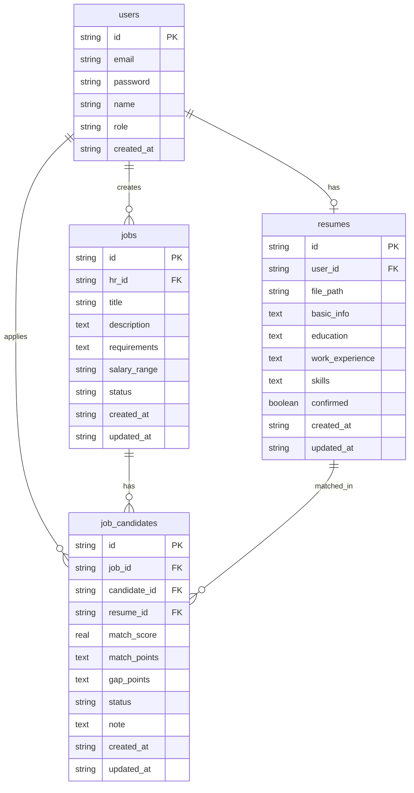

## 1. 架构设计

```mermaid
graph TB
    subgraph "前端层"
        "React SPA"
    end
    subgraph "后端层"
        "Express API Server"
        "简历解析服务"
        "语义匹配服务"
    end
    subgraph "数据层"
        "SQLite 数据库"
    end
    subgraph "外部服务"
        "大模型API(简历解析)"
        "Embedding API(语义向量)"
    end
    "React SPA" --> "Express API Server"
    "Express API Server" --> "简历解析服务"
    "Express API Server" --> "语义匹配服务"
    "简历解析服务" --> "大模型API(简历解析)"
    "语义匹配服务" --> "Embedding API(语义向量)"
    "Express API Server" --> "SQLite 数据库"
```

## 2. 技术说明

- 前端：React@18 + TailwindCSS@3 + Vite + Zustand
- 初始化工具：vite-init
- 后端：Express@4 + TypeScript (ESM)
- 数据库：SQLite（轻量级，无需额外安装）
- 外部API：大模型API（模拟调用，可替换为真实API）、Embedding API（模拟向量计算）

## 3. 路由定义

| 路由 | 用途 |
|------|------|
| / | 首页，角色选择入口 |
| /candidate/upload | 候选人简历上传与解析 |
| /candidate/resume | 候选人简历查看与编辑 |
| /hr/jobs | HR岗位管理列表 |
| /hr/jobs/new | 发布新岗位 |
| /hr/jobs/:id | 岗位匹配详情页（候选人列表） |
| /hr/candidates | 候选人筛选与导出页 |

## 4. API定义

### 4.1 认证相关

```typescript
POST /api/auth/register
  body: { email: string; password: string; role: "candidate" | "hr"; name: string }
  response: { user: User; token: string }

POST /api/auth/login
  body: { email: string; password: string }
  response: { user: User; token: string }
```

### 4.2 简历相关

```typescript
POST /api/resume/upload
  body: FormData { file: PDF文件 }
  response: { parsedData: ParsedResume }

PUT /api/resume/:id
  body: Partial<Resume>
  response: { resume: Resume }

GET /api/resume/me
  response: { resume: Resume | null }
```

### 4.3 岗位相关

```typescript
POST /api/jobs
  body: { title: string; description: string; requirements: string[]; salaryRange?: string }
  response: { job: Job }

GET /api/jobs
  response: { jobs: Job[] }

GET /api/jobs/:id
  response: { job: Job; candidates: MatchedCandidate[] }

PUT /api/jobs/:id
  body: Partial<Job>
  response: { job: Job }

DELETE /api/jobs/:id
  response: { success: boolean }
```

### 4.4 匹配相关

```typescript
POST /api/matching/calculate/:jobId
  response: { matches: MatchedCandidate[] }

PUT /api/matching/:jobId/:candidateId/status
  body: { status: "screening" | "interview" | "offer" | "rejected" }
  response: { success: boolean }

PUT /api/matching/:jobId/:candidateId/note
  body: { note: string }
  response: { success: boolean }

GET /api/matching/candidates?status=&minScore=&maxScore=&jobId=
  response: { candidates: MatchedCandidate[] }

GET /api/matching/export?jobId=&status=&minScore=&maxScore=
  response: Excel文件流
```

### 4.5 类型定义

```typescript
interface User {
  id: string;
  email: string;
  name: string;
  role: "candidate" | "hr";
}

interface ParsedResume {
  basicInfo: {
    name: string;
    phone: string;
    email: string;
    location: string;
  };
  education: Array<{
    school: string;
    degree: string;
    major: string;
    startDate: string;
    endDate: string;
  }>;
  workExperience: Array<{
    company: string;
    position: string;
    startDate: string;
    endDate: string;
    description: string;
  }>;
  skills: string[];
}

interface Resume extends ParsedResume {
  id: string;
  userId: string;
  filePath: string;
  confirmed: boolean;
  createdAt: string;
  updatedAt: string;
}

interface Job {
  id: string;
  hrId: string;
  title: string;
  description: string;
  requirements: string[];
  salaryRange: string;
  status: "open" | "closed";
  createdAt: string;
  updatedAt: string;
}

interface MatchedCandidate {
  candidateId: string;
  resumeId: string;
  candidateName: string;
  matchScore: number;
  matchPoints: string[];
  gapPoints: string[];
  status: "screening" | "interview" | "offer" | "rejected" | "pending";
  note: string;
  resume: Resume;
}
```

## 5. 服务端架构图

```mermaid
graph LR
    "Controller" --> "Service"
    "Service" --> "Repository"
    "Repository" --> "SQLite"
    "Service" --> "LLM API"
    "Service" --> "Embedding API"
```

## 6. 数据模型

### 6.1 数据模型定义



### 6.2 数据定义语言

```sql
CREATE TABLE users (
  id TEXT PRIMARY KEY,
  email TEXT UNIQUE NOT NULL,
  password TEXT NOT NULL,
  name TEXT NOT NULL,
  role TEXT CHECK(role IN ('candidate', 'hr')) NOT NULL,
  created_at TEXT DEFAULT (datetime('now'))
);

CREATE TABLE resumes (
  id TEXT PRIMARY KEY,
  user_id TEXT NOT NULL REFERENCES users(id),
  file_path TEXT NOT NULL,
  basic_info TEXT NOT NULL DEFAULT '{}',
  education TEXT NOT NULL DEFAULT '[]',
  work_experience TEXT NOT NULL DEFAULT '[]',
  skills TEXT NOT NULL DEFAULT '[]',
  confirmed INTEGER NOT NULL DEFAULT 0,
  created_at TEXT DEFAULT (datetime('now')),
  updated_at TEXT DEFAULT (datetime('now'))
);

CREATE TABLE jobs (
  id TEXT PRIMARY KEY,
  hr_id TEXT NOT NULL REFERENCES users(id),
  title TEXT NOT NULL,
  description TEXT NOT NULL,
  requirements TEXT NOT NULL DEFAULT '[]',
  salary_range TEXT,
  status TEXT CHECK(status IN ('open', 'closed')) DEFAULT 'open',
  created_at TEXT DEFAULT (datetime('now')),
  updated_at TEXT DEFAULT (datetime('now'))
);

CREATE TABLE job_candidates (
  id TEXT PRIMARY KEY,
  job_id TEXT NOT NULL REFERENCES jobs(id),
  candidate_id TEXT NOT NULL REFERENCES users(id),
  resume_id TEXT NOT NULL REFERENCES resumes(id),
  match_score REAL NOT NULL DEFAULT 0,
  match_points TEXT NOT NULL DEFAULT '[]',
  gap_points TEXT NOT NULL DEFAULT '[]',
  status TEXT CHECK(status IN ('pending', 'screening', 'interview', 'offer', 'rejected')) DEFAULT 'pending',
  note TEXT DEFAULT '',
  created_at TEXT DEFAULT (datetime('now')),
  updated_at TEXT DEFAULT (datetime('now')),
  UNIQUE(job_id, candidate_id)
);

CREATE INDEX idx_resumes_user_id ON resumes(user_id);
CREATE INDEX idx_jobs_hr_id ON jobs(hr_id);
CREATE INDEX idx_job_candidates_job_id ON job_candidates(job_id);
CREATE INDEX idx_job_candidates_candidate_id ON job_candidates(candidate_id);
CREATE INDEX idx_job_candidates_status ON job_candidates(status);
CREATE INDEX idx_job_candidates_score ON job_candidates(match_score);
```
